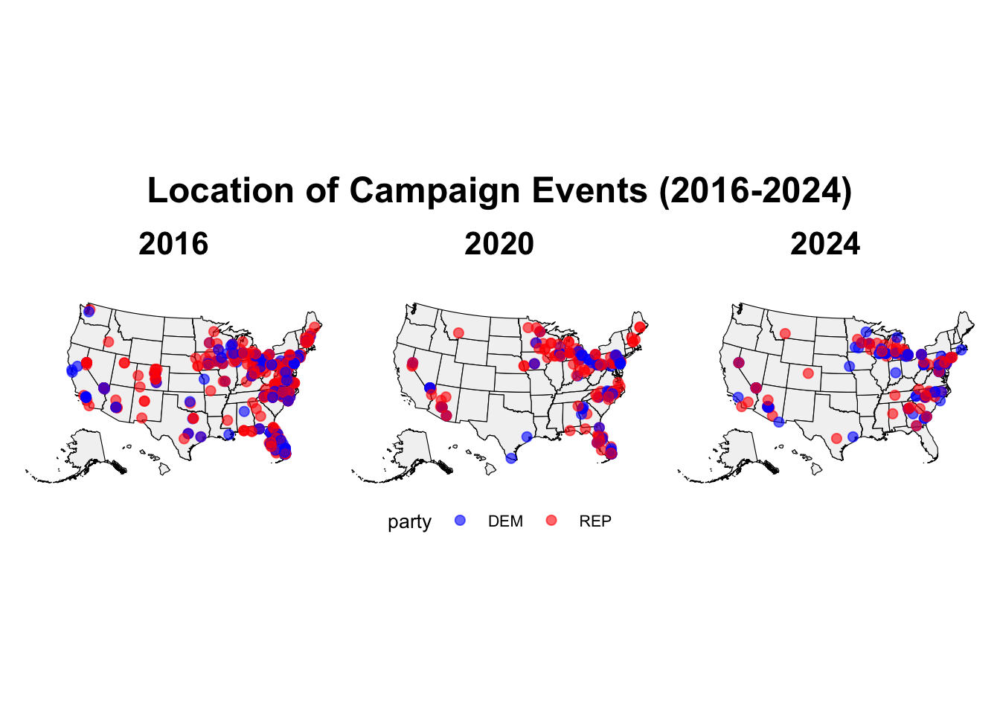

# Welcome Back!

Election day is _so soon_ and I am overjoyed! There are so many things at stake, and I am excited to see the results. Today, I will focus on the **ground game**, which is everything a campaign does via the ground! This includes door knocking, holding signs at intersections, setting up field offices, giving out signs, and many more fun campaign activities! If you want to know whether the ground game matters, read on!


# The Countdown is ON!

Are you wondering how many days there are until the election? I know I am! Check below to see.


```
## Time difference of 16 days
```


# When Do Campaign Events Happen?

Have you ever been to a campaign event? Sometimes they are in big hotels, or small cafes, or even in the candidates home. They are created to bring voters together in support for the candidate. Sometimes, these are informal gatherings of top donors and supporters, created to rally funding around the candidate to hit vital funding goals. Other times, these are events to allow the candidate to show another side of themselves. They can be used to convince unlikely voters by establishing a true, one-on-one connection that is normally not found in large presidential campaigns. Finally, likely the largest, and most prominent, type of campaign event is the infamous rally! In key states, locals should not be surprised to pass large stages adorned with red, white, and blue. 

Below, you will see the frequency of campaign events in the four months before the past 2 Presidential Elections, as well as the past three months of this cycle. You will not be at all surprised to see that campaign events always occur more often in the weeks leading up to the election. Candidates know there is always another vote they could receive, so they work tirelessly to mobilize voters in the final minutes before the big day. Check it out below!


# Where Are Campaign Events Happening?

Ready for something extra interesting? Below you will find a map of the United States of America. Atop the map of our lovely country are dots representing campaign events prior to a General Election. The dots reflect party. See anything fun? Hint: the right side of the country is _heavily_ favored by campaign events. One thing you should note is the data for 2024 is not up to date by the day, so some more recent events are not included. 

So, what states are receiving the most campaign attention? If you have been following the election, you may not be shocked to know states including Michigan, Wisconsin, North Carolina, Pennsylvania and Georgia are top contenders. See below!




# Prediction Time!

Okay okay time for the fun stuff. You will see below a regression table including last weeks data as well as an added coefficient for campaign events. I apologize that the term label is not updated to something cleaner than d_campaign_events, but I had the darndest trouble trying to change it!

Alas, below you will see the data. Some key results are as follows. First, the September Polling results continue to be statistically significant in this situation, though the estimate is negative, meaning an increase in Sept polling will lead to a decrease in Dem popular vote share. Next, October Results, which are incredibly statistically significant, and they account for a 1.5 point dependent variable increase. Finally, the Campaign Events coefficient is statistically significant, signifying a negative change of .04 points for every increase in campaign events. I would venture to say this very small difference is likely not 


```{=html}
<div class="datatables html-widget html-fill-item-overflow-hidden html-fill-item" id="htmlwidget-5a41e63fcacf84d4fceb" style="width:100%;height:auto;"></div>
<script type="application/json" data-for="htmlwidget-5a41e63fcacf84d4fceb">{"x":{"filter":"none","vertical":false,"caption":"<caption>Updated Regression Results<\/caption>","data":[["1","2","3","4"],["(Intercept)","September_Results","October_Results","d_campaign_events"],[2.377939261282986,-0.435227186443171,1.502277208296008,-0.04061053998396454],[1.523853268113665,0.1868263882729174,0.1830213399763204,0.01353271786017741],[1.560477843268053,-2.329580903782113,8.208207897999083,-3.000915293111131],[0.1202520053741619,0.02084144926203338,2.891482333275939e-14,0.003039698482491141]],"container":"<table class=\"display\">\n  <thead>\n    <tr>\n      <th> <\/th>\n      <th>term<\/th>\n      <th>estimate<\/th>\n      <th>std.error<\/th>\n      <th>statistic<\/th>\n      <th>p.value<\/th>\n    <\/tr>\n  <\/thead>\n<\/table>","options":{"pageLength":4,"columnDefs":[{"className":"dt-right","targets":[2,3,4,5]},{"orderable":false,"targets":0},{"name":" ","targets":0},{"name":"term","targets":1},{"name":"estimate","targets":2},{"name":"std.error","targets":3},{"name":"statistic","targets":4},{"name":"p.value","targets":5}],"order":[],"autoWidth":false,"orderClasses":false,"lengthMenu":[4,10,25,50,100]},"selection":{"mode":"multiple","selected":null,"target":"row","selectable":null}},"evals":[],"jsHooks":[]}</script>
```


